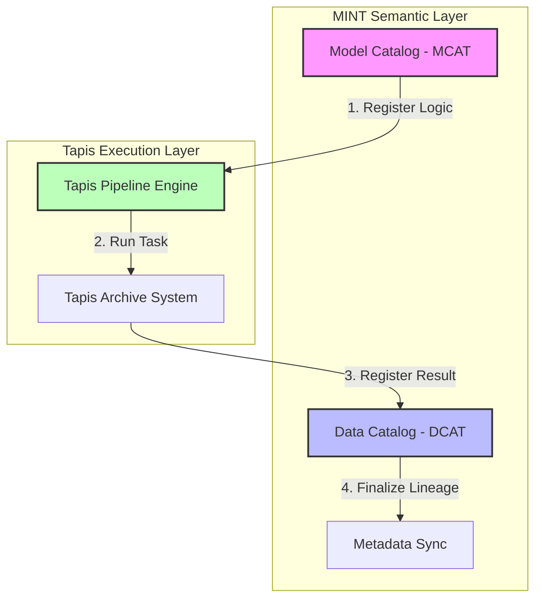

This revised README incorporates the architectural distinction between the **Model Catalog (MCAT)** and the **Data Catalog (DCAT)**, establishing a complete framework for semantic data orchestration.

---

# Semantic Orchestration: The Tapis-MINT Hybrid Framework

## Overview

This framework bridges high-performance execution (**Tapis v3**) with semantic data management (**MINT**). By decoupling the **logic** (Model Catalog) from the **data** (Data Catalog), we create a modular environment where ETL pipelines and analytical models are treated as first-class citizens in a global knowledge graph.

### The Core Architecture

* **Tapis v3 (The Muscle):** Handles container orchestration, secure execution, and high-volume data movement.
* **MINT MCAT (The Logic):** Stores the metadata and "recipes" for pipelines.
* **MINT DCAT (The Archive):** Manages data lineage, dataset registration, and the physical location of resources.

---

## Integrated Workflow Architecture

The following diagram illustrates how the system transitions from registering a logical tool to archiving physical data results.

---

## Implementation Phases

### 1. Logic Registration (MCAT)

The pipeline is registered as a `ModelConfiguration`. This stage does not involve data; it defines the **how**.

* **Payload:** Includes the Tapis Pipeline ID, Group ID, and the software image (e.g., from GHCR).
* **Outcome:** A unique URI in MINT that represents a specific analytical capability.

### 2. Physical Execution (Tapis)

The orchestrator triggers the pipeline via the Tapis API.

* **Security:** Uses Tapis credentials and service tokens to manage compute resources.
* **Monitoring:** The system polls the `/runs` endpoint until the state reaches `COMPLETED`.

### 3. Data Archiving & Lineage (DCAT)

Based on the `provenance_id`, the output of the Tapis run is registered as a new **Dataset** in MINT.

* **Datasets:** High-level containers for the run's results.
* **Resources:** The actual file links (CSV, logs, NetCDF) stored in the Tapis Archive.
* **Standard Variables:** Mapping the columns of the output data to MINT’s global knowledge graph.

---

## Expected Outcomes & Impact

By effectively implementing this architecture, the following operational goals are achieved:

### 1. End-to-End Traceability (Provenance)

Every data point in the system is linked back to the specific execution that created it. By using a consistent `provenance_id`, we can audit the entire lifecycle of a dataset—from raw network logs to final processed visualizations—ensuring transparency and reproducibility.

### 2. Seamless Semantic Interoperability

By registering **Standard Variables** in the DCAT, the system understands the *meaning* of the data.

* **Automated Discovery:** Future models can automatically find and consume datasets because they "speak" the same semantic language (e.g., recognizing `latency` or `throughput` regardless of the original file name).

### 3. Modular Scalability (DevSecOps Efficiency)

The architecture promotes a "plug-and-play" mentality for data processing:

* **Isolation of Failures:** Since ETL Prep, Analysis, and Post-ETL are separate MINT configurations, failures can be isolated and debugged without affecting the entire chain.
* **Reusable Pipelines:** A single Tapis ETL pipeline can be registered as an input for multiple different MINT models, drastically reducing redundant code development.

### 4. Data Lineage as a Service

The integration moves beyond simple file storage. It transforms raw files into **managed resources** where MINT acts as the authoritative index, ensuring that the "Data Fabric" is always synchronized with the "Compute Fabric."

---
