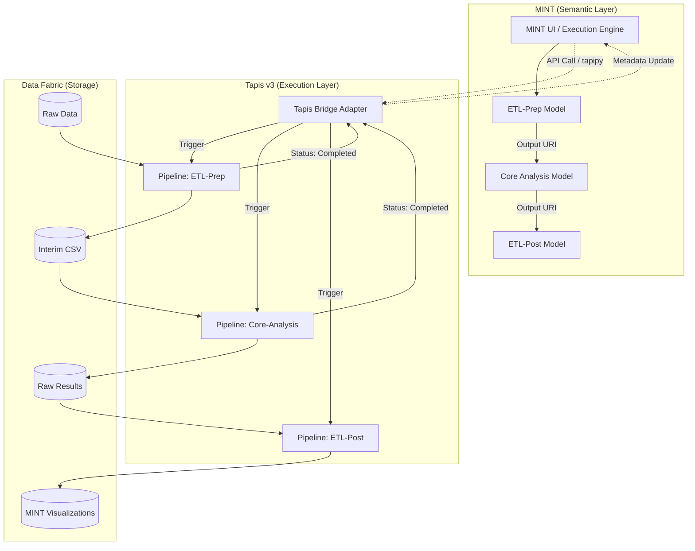

This README outlines the architectural strategy for integrating **Tapis Workflows** with the **MINT (Model INTegration)** ecosystem. The goal is to evolve the integration from a simple "app launcher" into a full **Semantic Orchestration Framework** where ETL pipelines and analytical tasks are registered as modular, reusable MINT Models.

---

# Semantic Orchestration: Bridging Tapis Workflows & MINT

## Overview

This project establishes a framework for managing the complete lifecycle of scientific data. By leveraging **MINT** as a semantic orchestrator and **Tapis v3** as a distributed execution engine, we can chain complex ETL (Extract, Transform, Load) processes before and after model execution.

### Core Philosophy

* **Modularity:** ETL pipelines (Prep/Post) are registered as independent MINT Models.
* **Lineage:** MINT tracks the provenance of data as it flows through Tapis tasks.
* **Scalability:** Tapis handles high-performance compute and container orchestration, while MINT handles the logical flow.

## System Architecture

### 1. MINT (The Brain)

MINT acts as the **Model Catalog** and **User Interface**. It stores the semantic definitions of:

* **ModelConfigurations:** Metadata pointing to specific Tapis Pipeline IDs.
* **DatasetSpecifications:** Definitions of the input/output schemas (e.g., CSV, NetCDF).
* **Parameters:** Variables that control the behavior of the Tapis tasks.

### 2. Tapis Workflows (The Muscle)

Tapis provides the **Execution Environment**. It manages:

* **Pipelines:** Sequences of tasks (ETL or Analysis).
* **Tasks:** Containerized logic (via GHCR/Docker) or Python functions.
* **Archive Systems:** Persistent storage where results are stored and retrieved.

---

## The ETL Lifecycle Workflow

---

## Implementation Details

### 1. Registration Phase

Instead of registering a single "App," we register a series of **ModelConfigurations** in MINT.

* **ETL-Prep Configuration:** Maps a Tapis pipeline that cleans raw sensor/log data into a "Gold Standard" format.
* **Analysis Configuration:** Maps the scientific code that processes the Gold Standard data.
* **ETL-Post Configuration:** Maps the transformation of raw model output into human-readable or MINT-compatible formats.

### 2. The Tapis-MINT Bridge

The execution is handled by a Python-based adapter (using `tapipy`) that:

1. **Extracts Metadata:** Reads the Tapis `group_id` and `pipeline_id` from the MINT `ModelConfiguration`.
2. **Handles Encoding:** Ensures Python code strings are correctly padded (Base64) to avoid "Incorrect Padding" errors during `function` task execution.
3. **Polls for State:** Monitors Tapis task status (`ACTIVE` -> `COMPLETED`) before signaling MINT to proceed to the next node in the graph.

### 3. Data Integration

Data is passed between Tapis tasks using the Tapis **Archive System**. MINT tracks these locations as `DataResources`, ensuring that the output of an ETL-Prep task is automatically fed as the input to the Core Analysis task.

## Key Benefits

* **Reusability:** A single ETL-Prep pipeline can be used for multiple different models.
* **Observability:** DevSecOps engineers can monitor which specific segment of the lifecycle (Prep, Analysis, or Post) failed.
* **Interoperability:** New models can be integrated into the workflow simply by registering their Tapis Pipeline IDs in the MINT Model Catalog.

---
